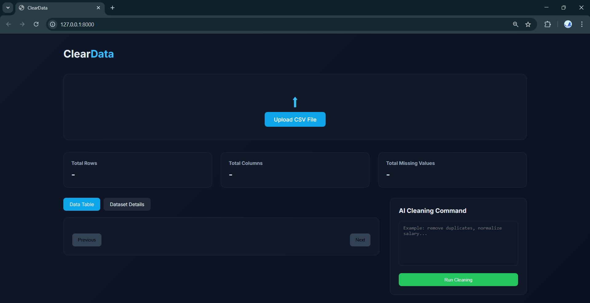
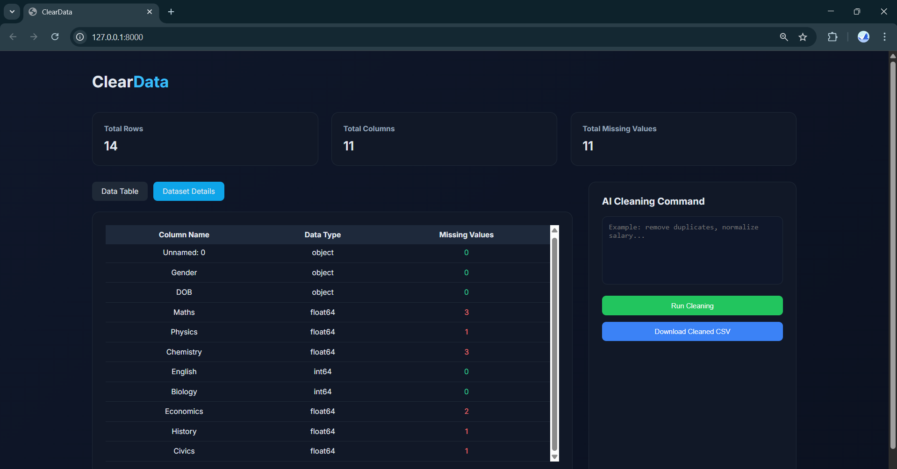

# 🤖 ClearData  
Natural Language Driven CSV Data Cleaning API using FastAPI + Machine Learning

ClearData  allows users to upload a CSV file and perform data preprocessing operations using natural language commands  
(e.g., “fill missing values with mean”, “normalize salary column”, “remove outliers from age”).

---

## 🚀 Features

- 📂 Upload CSV files
- 🧠 NLP-based operation detection 
- 🧹 Data Cleaning Operations:
  - Remove duplicate rows
  - Fill missing values (mean / median / zero)
  - Label Encoding
  - Standardization
  - Normalization
  - Type Casting (int, float, bool, string, datetime)
  - Drop column
  - Remove outliers (IQR method)
- 📊 Pagination support for previewing data
- 📥 Download processed CSV
- 📈 Dataset information endpoint

---

## 📁 Project Structure

```
ClearData/
│
├── main.py
├── models/
│   ├── tfidf_vectorizer.pkl
│   ├── logistic_classifier.pkl
│   └── label_encoder.pkl
│
├── templates/
│   └── index.html
│
├── uploads/
│
└── README.md
```

---

## ⚙️ Requirements

- Python 3.9+
- Trained model files inside the `models/` folder:
  - `intent_lstm_model.keras`
  - `label_encoder.pkl`
  - `tokenizer.pkll`

⚠️ If these model files are missing, the application will fail at startup.

---

## 📦 Install Dependencies

```bash
pip install fastapi uvicorn pandas numpy scikit-learn joblib rapidfuzz jinja2 python-multipart
```

---

## ⚙️ Run Application

```bash
python -m uvicorn main:app --reload
```

The application will run on:

```
http://127.0.0.1:8000
```

---


---

## 📸 Screenshots

Here are some screenshots of the application in action:


*Screenshot showing the data preview feature.*


*Screenshot showing the data cleaning options.*


*Screenshot of the dataset information page.*

---

## ⚙️ Requirements

- Python 3.9+
- Trained model files inside the `models/` folder:
  - `intent_lstm_model.keras`
  - `label_encoder.pkl`
  - `tokenizer.pkl`

⚠️ If these model files are missing, the application will fail at startup.

---

## 📦 Install Dependencies

```bash
pip install fastapi uvicorn pandas numpy scikit-learn joblib rapidfuzz jinja2 python-multipart