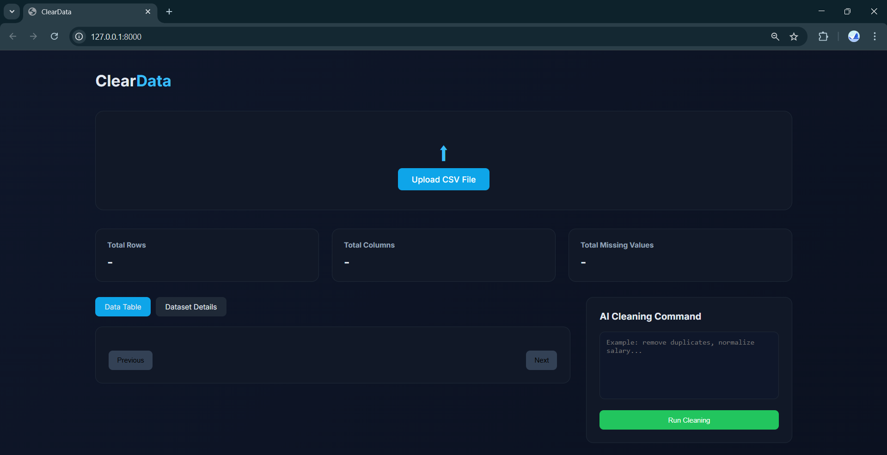
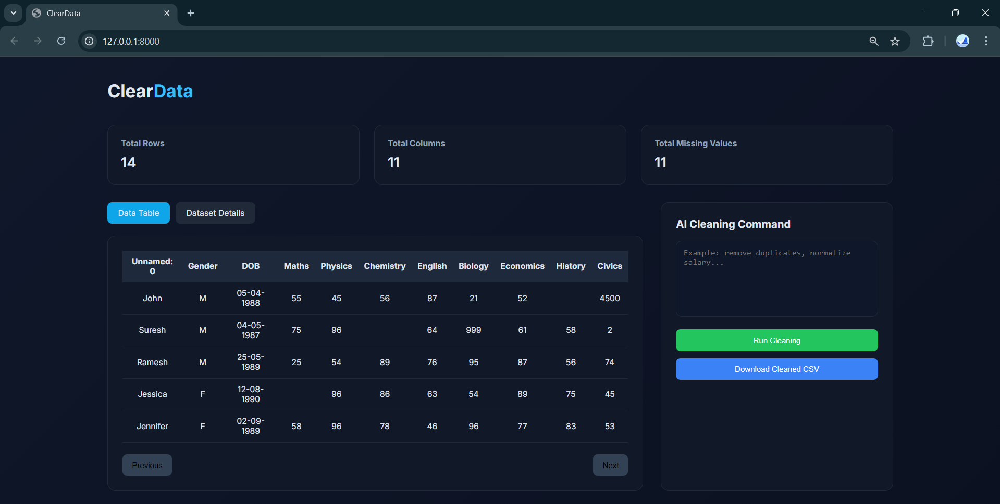
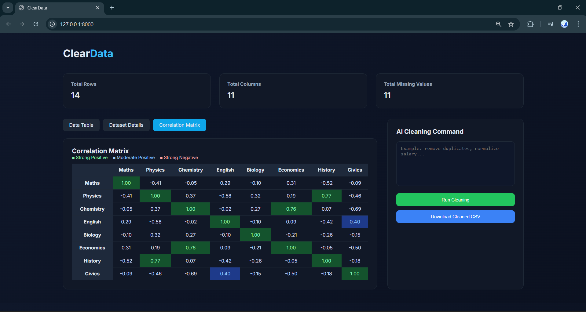

# ClearData

<p align="center">
  
</p>

<p align="center">
  <strong>AI-Powered Data Cleaning & Dataset Analysis Using Natural Language</strong>
</p>

<p align="center">
  Upload a CSV • Describe what you want in plain English • Let AI clean and analyze your data
</p>

<p align="center">


</p>

---

# Overview

**ClearData** is an AI-powered data preprocessing application that enables users to clean, transform, and analyze CSV datasets using natural language commands.

Instead of writing Pandas code or manually preprocessing data, users simply upload a dataset and describe the desired operation in plain English.

Examples:

> Remove duplicate rows

> Fill missing values in Age with mean

> Normalize Salary column

> Convert Date to datetime

> Remove outliers from Sales

ClearData interprets the instruction using an **LSTM-based Natural Language Processing model**, extracts relevant parameters using **RapidFuzz**, executes the requested operation using **Pandas**, and instantly updates the dataset.

The goal is simple:

> **Make data preparation as easy as having a conversation.**

---

# Features

## Data Cleaning

- Remove duplicate rows
- Fill missing values
  - Mean
  - Median
  - Zero
- Remove outliers using the IQR method
- Drop unwanted columns

---

## Data Transformation

- Standardization
- Normalization
- Label Encoding
- Convert column data types
  - Integer
  - Float
  - String
  - Datetime

---

## Dataset Analysis

- Dataset information
- Missing values summary
- Data types
- Statistical summary (`describe()`)
- Correlation matrix

---

## Dataset Management

- Upload CSV files
- Preview data with pagination
- Download processed CSV

---

# System Architecture

```text
                 Upload CSV
                     │
                     ▼
              FastAPI Backend
                     │
                     ▼
      TensorFlow LSTM Intent Classifier
                     │
                     ▼
      RapidFuzz Parameter Extraction
      ├── Column Detection
      ├── Data Type Detection
      └── Fill Method Detection
                     │
                     ▼
          Pandas Processing Engine
                     │
      ┌──────────────┼──────────────┐
      ▼              ▼              ▼
 Clean Dataset   Dataset Info   Correlation
                     │
                     ▼
             Download Processed CSV
```

---

# Workflow

```text
Upload CSV
      │
      ▼
Write a Natural Language Command
      │
      ▼
LSTM predicts the user's intent
      │
      ▼
RapidFuzz extracts required parameters
      │
      ▼
Pandas executes the operation
      │
      ▼
Updated dataset is displayed
      │
      ▼
Download cleaned CSV
```

---

# Application Walkthrough

## Dashboard

The dashboard provides an interface for uploading datasets, previewing data, entering natural language commands, and viewing dataset analysis.

<p align="center">

</p>

---

## Dataset Summary

View dataset information including:

- Number of rows
- Number of columns
- Missing values
- Data types
- Statistical summary

<p align="center">

</p>

---

## Correlation Matrix

Analyze relationships between numerical features using an automatically generated correlation matrix.

<p align="center">

</p>

---

# Natural Language Processing Pipeline

Unlike simple keyword-based systems, ClearData uses a hybrid AI pipeline.

### Step 1

The user enters a natural language command.

```
Fill missing values in Age with mean
```

↓

### Step 2

The command is tokenized using the trained tokenizer.

↓

### Step 3

The LSTM model predicts the intended operation.

↓

### Step 4

RapidFuzz extracts:

- Column name
- Fill strategy
- Data type
- Other parameters

↓

### Step 5

Pandas executes the requested operation.

↓

### Step 6

The updated dataset is displayed instantly.

---

# Supported Commands

## Missing Values

```text
Fill missing values with mean

Fill missing values with median

Fill missing values with zero
```

---

## Duplicate Records

```text
Remove duplicate rows
```

---

## Standardization

```text
Standardize Age column
```

---

## Normalization

```text
Normalize Salary column
```

---

## Label Encoding

```text
Label encode Gender
```

---

## Type Conversion

```text
Convert Salary to integer

Convert Date to datetime

Convert Price to float
```

---

## Remove Columns

```text
Drop Email column
```

---

## Remove Outliers

```text
Remove outliers from Sales
```

---

# REST API

| Method | Endpoint | Description |
|---------|----------|-------------|
| GET | `/` | Web interface |
| POST | `/upload` | Upload CSV |
| GET | `/get_page` | Dataset pagination |
| POST | `/process` | Execute natural language command |
| GET | `/get_info` | Dataset summary |
| GET | `/get_correlation` | Correlation matrix |
| GET | `/download` | Download processed CSV |

---

# Tech Stack

| Category | Technologies |
|------------|----------------|
| Backend | FastAPI |
| NLP Model | TensorFlow / Keras (LSTM) |
| Data Processing | Pandas |
| Numerical Computing | NumPy |
| Machine Learning | Scikit-learn |
| Fuzzy Matching | RapidFuzz |
| Frontend | HTML, CSS, JavaScript |

---

# Project Structure

```text
ClearData
│
├── Images/
│   ├── Screenshot_1.png
│   ├── Screenshot_2.png
│   ├── Screenshot_3.png
│   ├── Screenshot_4.png
│   ├── Screenshot_5.png
│   └── Screenshot_6.png
│
├── models/
│   ├── intent_lstm_model.keras
│   ├── tokenizer.pkl
│   └── label_encoder.pkl
│
├── templates/
│   └── index.html
│
├── uploads/
│
├── main.py
├── TEST.csv
└── README.md
```

---

# Installation

## Clone the Repository

```bash
git clone https://github.com/Pavan-Kumar-2095/ClearData.git

cd ClearData
```

---

## Install Dependencies

```bash
pip install fastapi uvicorn pandas numpy tensorflow scikit-learn rapidfuzz joblib jinja2 python-multipart
```

---

## Model Files

Place the trained model files inside the `models/` directory.

```text
models/
├── intent_lstm_model.keras
├── tokenizer.pkl
└── label_encoder.pkl
```

---

## Run the Application

```bash
uvicorn main:app --reload
```

Open your browser:

```text
http://127.0.0.1:8000
```

---

# Example Workflow

### Sample Dataset

| Name | Age | Salary |
|------|-----|---------|
| John | NaN | 50000 |
| John | NaN | 50000 |
| Alice | 24 | NaN |

Command:

```text
Fill missing Age with mean
```

Then:

```text
Remove duplicate rows
```

Result:

- Missing values are filled.
- Duplicate records are removed.
- The cleaned dataset is available for download.

---

# Future Improvements

- Execute multiple commands in a single request
- Chat history
- Undo previous operations
- AI-generated preprocessing suggestions
- Excel (.xlsx) support
- SQL database support
- Interactive visualizations
- Feature engineering
- LLM integration for advanced conversational understanding

---

# Contributing

Contributions are welcome.

1. Fork the repository.
2. Create a feature branch.
3. Commit your changes.
4. Push your branch.
5. Open a Pull Request.

---

# Feedback

Suggestions, feature requests, and improvements are always welcome.

Feel free to open an issue or submit a Pull Request.


---

# Support

If you found this project useful, consider giving it a star on GitHub.
---


